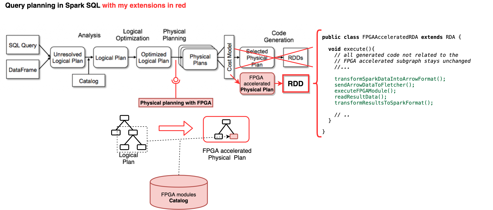

# Accelerating Spark SQL by executing transparently subquerries on Fletcher FPGAs

This repository contains my work/implementation which I do during my Masterthesis at the [Accelerated Big Data Systems of TUDelft](https://www.tudelft.nl/en/eemcs/the-faculty/departments/quantum-computer-engineering/accelerated-big-data-systems/) 

> :warning: This project is in a very early stage and currently the goal is to understand the involved technologies. I aim to build a minimal runnable solution at first. Therefor, the code is very volatile and sometimes aiming for a dirty solution.

## Goal

* Mapping of SparkSQL queries to FPGA building blocks and execute them by using [Fletcher](https://github.com/abs-tudelft/fletcher) & [Appache Arrow](https://github.com/apache/arrow)

## Architecture Overview Draft

## Build

Unfortunately building and executing the project requires some (complex) preconditions. To make things easier I provide a
[Dockerfile](/docker) which can be used for building the project or as reference for the different steps   

1. [Install protobuf](https://github.com/protocolbuffers/protobuf/blob/master/src/README.md) libs and generator 
2. [Build Appache Arrow](https://arrow.apache.org/docs/developers/cpp/building.html) with the options: 
    * `DARROW_PARQUET=ON`
    * `DARROW_GANDIVA=ON` (Requires llvm in version 8)
    * `DARROW_GANDIVA_JAVA=ON`
3. Install it from the release dir: `sudo make install`
4. [Build the Appache Arrow gandiva jar file](https://github.com/apache/arrow/tree/master/java#building-and-running-tests-for-arrow-jni-modules-like-gandiva-and-orc-optional) Pay attention that the parameter `-Darrow.cpp.build.dir` is correct, because only then the gandiva libraries are copied into jar file.
5. Install [Fletcher runtime](https://github.com/abs-tudelft/fletcher/tree/develop/runtime/cpp) and for the current tests [the Fletcher echo plattform](https://github.com/abs-tudelft/fletcher/tree/develop/platforms/echo/runtime)
6. Set the following environment variables
    * `ARROW_ROOT` (Gradle looks for the Gandiva jar file in `$ARROW_ROOT/java/gandiva/target/arrow-gandiva-0.17.0.jar`)
    * `LOCAL_LIBRARY_PATH` (if different than `/usr/local/lib`)
7. Run the gradle build (including tests) `./gradlew build`

## Project structure

* `spark-extension`: this code integrates with spark and is replacing the default strategy of generating the execution plan.
* `arrow-processor` scala part which forward the Arrow vectors to the native code
* `arrow-processor-native` code that is responsible for the execution of the processing steps. For now it calls different C++ components e.g. the arrow parquet reader & gandiva) later it should call a Fletcher runtime. 